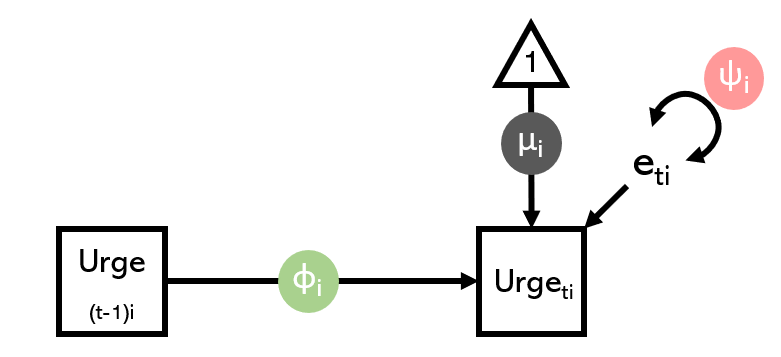

<style>
body {
text-align: justify}
</style>

```{r setup, include=FALSE}
knitr::opts_chunk$set(echo = FALSE)
```

```{r, layout = "l-body-ouset", fig.width=3, echo=FALSE}

```

Dynamic Structural Equations Models (DSEMs; [Asparouhov et al., 2018](https://www.tandfonline.com/doi/full/10.1080/10705511.2017.1406803); [McNeish et al., 2020](https://oce.ovid.com/article/00060744-202010000-00005/HTML)) have become increasingly popular to analyze time series data. One of the simplest versions contains three parameters: the average time series value (mean), how your time series lingers from one time point to the next (first-order autogression), and any unexplained fluctuations (residual variance). We recently wrote a preprint on how fitting an extended "DYNASTI" DSEM, in which you allow temporal dynamics to differ for above- and below-average time series values, allows you to uncover interesting asymmetric dynamics in your time series data. Check out the preprint [here](https://doi.org/10.31219/osf.io/3b5ra)! Interested in fitting the models to your own data? Try the [tutorial](https://jessicaschaaf.github.io/jessicaschaaf/dsem-workshop.html) I created together with Michael Aristodemou, Feline van Aagten, and Rogier Kievit! It uses Bayesian estimation through the open software [Stan](https://mc-stan.org/).