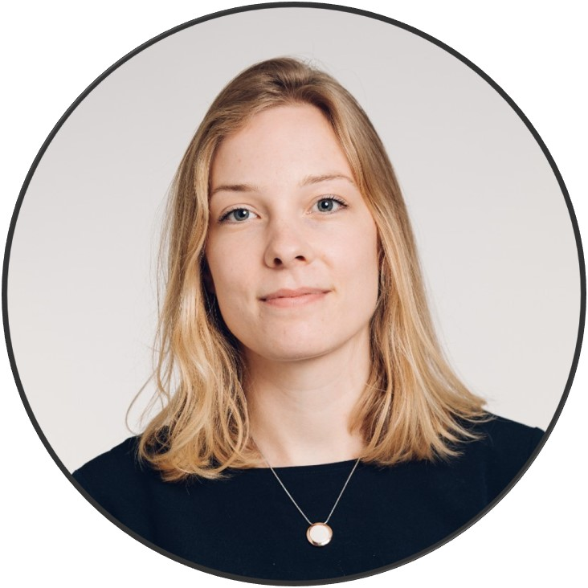

```{r, out.width = "40%", fig.align = 'center', echo=FALSE}

```

<div style="text-align: justify"> Have you ever wondered why you can easily remember where you parked your car one day, but spend minutes on finding it another day? Or why some people are much more affected by a poor night’s sleep than for others? Such questions keep bothering me and that's why I investigate them. 

I mostly do so through experiments and mathematical modeling. In this way, I can get to the bottom of the processes underlying cognitive capacities like memory, learning, and decision-making. You can find my CV [here](https://jessicaschaaf.github.io/jessicaschaaf/CV_JessicaSchaaf.pdf).</div>

\
<font size=5>**News**</font> \
February 22nd & March 21st, 2026: **Kletskoppen festival and Donders Open Day** \
Together with Feline van Aagten, Kevin Reniers, and Lena Kohler, I represented the Lifespan Cognitive Dynamics lab at two outreach events. First Kletskoppen festival, where children learned all about language, and then the Donders Open Day, teaching visitors all about the brain and giving them a behind-the-scenes experience. We tested how different noise sources affect (fluctuations in) cognitive performance. Results coming soon! 

\
December 18th, 2025: **Symposium on the positive side of cognitive variability** \

\
September 16th, 2025: **Symposium upcoming!** \
At the upcoming [NVP Winter Conference](https://www.societyforbrainandcognition.nl/general-information-nvp/), Rogier, [Senne Braem](https://users.ugent.be/~sbraem/index.html), [Marijn van Dijk](https://www.rug.nl/staff/m.w.g.van.dijk/), Janne Reynders, and I will organize a symposium on the positive side of cognitive variability. Our symposium will challenge attendees to think about potential positive aspects of variability, such as that it can be indicative of problem-solving skills, creativity, or developmental leaps. We discuss innovative ways to measure and quantify cognitive variability. Don't forget to [sign up](https://www.societyforbrainandcognition.nl/registration/)! 

\
September 1st, 2025: **Learn all about (f)MRI** \
Next week it is time for the [Donders Toolkit fMRI](https://www.ru.nl/en/donders-institute/agenda/donders-toolkit-fmri) again. A crash course on everything you need to know about (f)MRI analyses. On Tuesday, I'll tell you about ways to assess brain development using latent change score models, latent growth curve models, and non-linear methods.